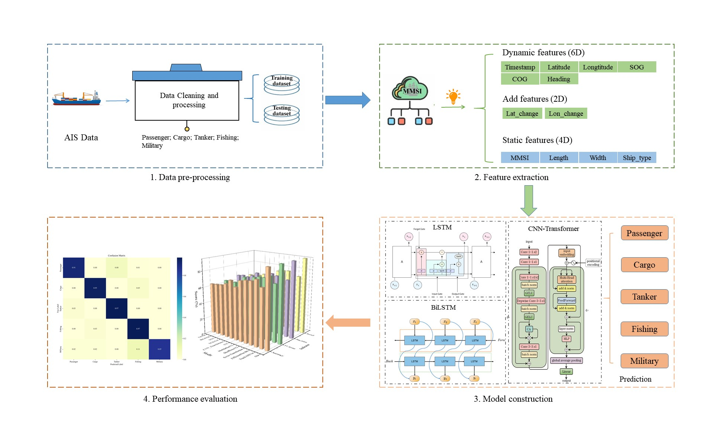
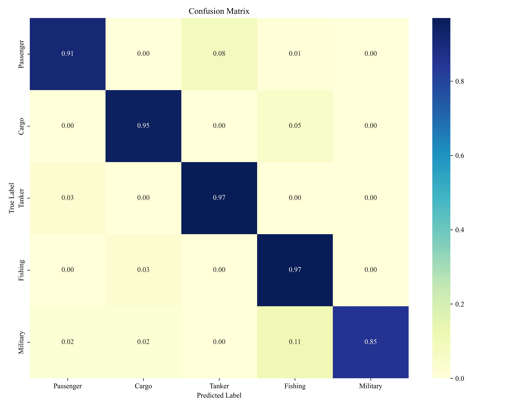

AISFusionNet is a multimodal deep learning model designed to classify vessel types by fusing two complementary sources of maritime information:

AIS time-series features: Including Speed over Ground (SOG), Course over Ground (COG), Heading, etc.

Trajectory images: Visual representations of ship paths over time.

The model integrates both temporal and spatial patterns using a dual-branch architecture:

A TimesNet-based branch processes AIS sequences, capturing temporal dependencies.

A ResNet/EfficientNet-based image branch extracts semantic features from trajectory images.

Finally, features are fused and passed to a fully connected classifier.

This architecture enables the model to leverage both numerical and visual information, significantly improving classification accuracy on challenging ship types.

### 1.AISFusion

This is a multimodal deep learning model designed for fine-grained ship classification. It fuses both AIS time-series features and trajectory images to leverage complementary spatial-temporal information.

The workflow includes four main stages:
1. **Data Pre-processing**: Clean and structure AIS data into five classes (Passenger, Cargo, Tanker, Fishing, Military).
2. **Feature Extraction**: Extract 12 features including dynamic (e.g., SOG, COG), static (e.g., Length, Width), and derived features (e.g., location changes).
3. **Model Construction**: Explore LSTM, BiLSTM, and CNN-Transformer architectures, ultimately combining time-series and image branches into the proposed AISFusionNet.
4. **Performance Evaluation**: Use confusion matrices and 3D metrics to evaluate classification performance.

Below are the confusion matrices of several models used in ship classification:
### 2.Martix

