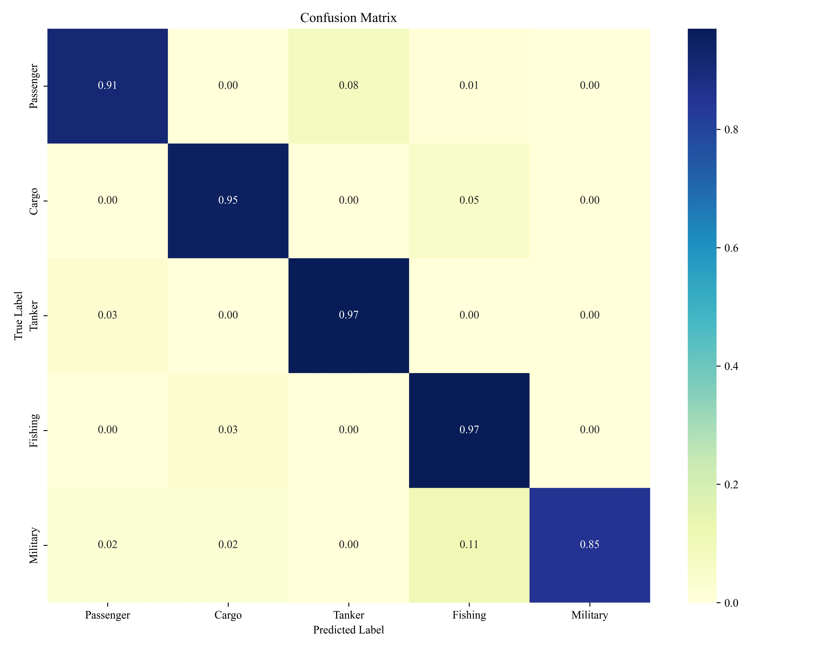

AISFusionNet is a multimodal deep learning model designed to classify vessel types by fusing two complementary sources of maritime information:

AIS time-series features: Including Speed over Ground (SOG), Course over Ground (COG), Heading, etc.

Trajectory images: Visual representations of ship paths over time.

The model integrates both temporal and spatial patterns using a dual-branch architecture:

A TimesNet-based branch processes AIS sequences, capturing temporal dependencies.

A ResNet/EfficientNet-based image branch extracts semantic features from trajectory images.

Finally, features are fused and passed to a fully connected classifier.

This architecture enables the model to leverage both numerical and visual information, significantly improving classification accuracy on challenging ship types.

Below are the confusion matrices of several models used in ship classification:
### 1.AISFusion

